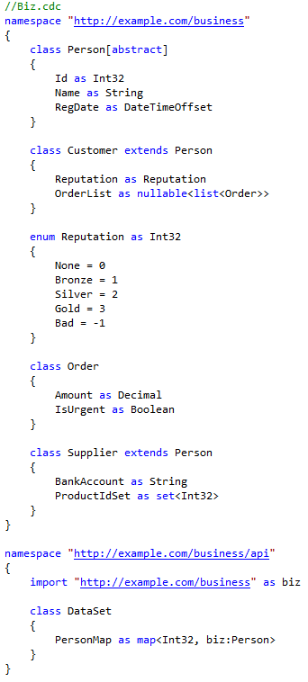
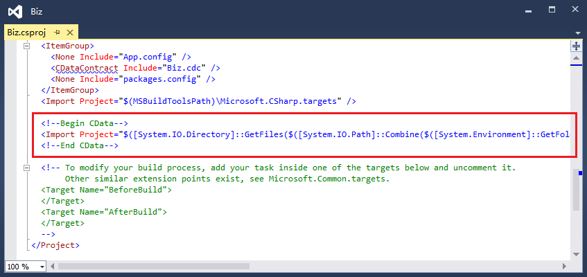
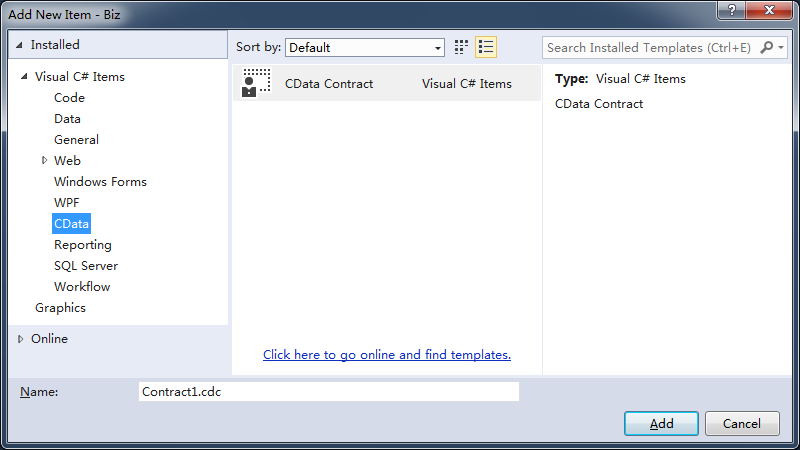
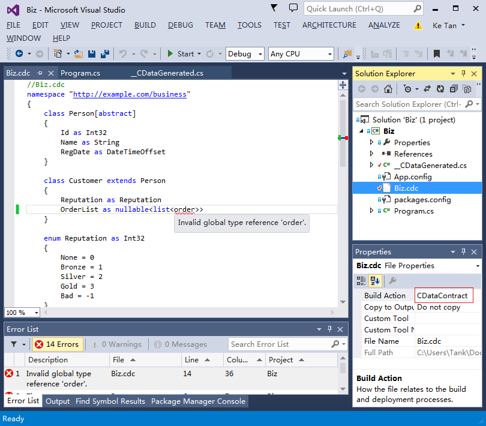

## CData：契约化数据交换方案

### 介绍

在进行数据交换前，双方一定对要交换的数据的结构和类型达成了一致，即建立了一个数据契约（data contract），我们通常用汉语英语等人类语言来书写数据契约文档，比如“此API返回一个名-值对的无序集合，第一个名字叫Id，类型是int32，第二个名字叫FullName，类型是string，...”，数据契约也可能只是开发人员间在口头约定（这很糟糕）。CData发明了一门机器可懂的数据契约语言，等一下，“机器可懂的数据契约语言”，那不就是纲要（schema）嘛，比如XML Schema，对，在本文中，契约（contract）和纲要（schema）是同义词，但我认为契约更容易被理解。XML Schema复杂笨重，它是一群科学家化的工程师（IBM盛产此物种）造出来的看上去很美实际却没啥用的象牙塔。CData契约语言（the CData contract language）轻盈灵动，完全接地气，下面是一个电子商务网站CData数据契约的示例：



CData契约语言是从面向对象编程语言中抽象出来的数据描述语言，除了语法上稍微有点怪异，程序员应该能立即产生感性上认识。契约定义了类型（type），这包括系统预定义的原子类型（atom type，如`Int32`，`String`，`DateTimeOffset`，`Boolean`等），以及用户定义的类类型（class type，如`Person`，`Customer`）和枚举类型（enum type，如`Reputation`）。类（class）由零到多个唯一命名的属性（property）组成，属性是倒置式声明的（`名称 as 类型`），其实，我觉得C语言家族的`类型 名称`才是倒置式的、反直觉的，`名称 as 类型`是正置式的、符合直觉的。属性的类型可以引用原子或用户类型，也可以定义匿名的数据容器类型：列表类型（list type，`list<>`）是一个有序列表，其条目可以重复；集合类型（set type，`set<>`）是一个无序集合，其条目不能重复；映射类型（map type，`map<,>`）是一个键-值对（key-value pair）的无序集合，键必须唯一。 可空类型（nullable type，`nullable<>`）指示包含的类型可以接受null值，否则不能接受null值。类可以标注为抽象（abstract）的，它不能拥有值，一个类可以从另一个类派生。枚举类型本质上是原子类型，它的每个成员为一个原子值（atom value）取了个名字。一组类型被放置在一个名称空间（namespace）中，名称空间由URI标识。一个名称空间中的成员可以引用另一个名称空间的成员，这需要使用导入（import）指令。

契约定义了类型，类型的值（value）即数据（data），契约与数据的关系如同蛋糕模具与蛋糕的关系。CData定义了自己的基于文本的数据格式（the CData data format）。下面的数据符合上面的契约：

```
a0:DataSet <a0 = @"http://example.com/business/api" a1 = @"http://example.com/business"> {
    PersonMap = #[
        1 = a1:Customer {
            Id = 1
            Name = @"Tank"
            RegDate = "2015-03-31T10:26:50.4939151+08:00"
            Reputation = $a1:Reputation.None
            OrderList = [
                a1:Order {
                    Amount = 436.99
                    IsUrgent = true
                }
                a1:Order {
                    Amount = 98.77
                    IsUrgent = false
                }
            ]
        }
        2 = a1:Customer {
            Id = 2
            Name = @"Mike"
            RegDate = "2015-03-31T02:26:50.4939151+00:00"
            Reputation = $a1:Reputation.None
            OrderList = null
        }
        3 = a1:Supplier {
            Id = 3
            Name = @"Eric"
            RegDate = "2015-03-08T11:26:50.4939151+00:00"
            BankAccount = @"11223344"
            ProductIdSet = [
                1
                3
                7
            ]
        }
    ]
}
```

类值（class value）即对象（object），一个CData数据文件必须包含且仅包含一个根对象，每个对象必须标明它所属的类，在契约中，类型被包含在名称空间中的，在数据中，先声明名称空间的URI，然后通过别名（alias，如上例中的`a0`，`a1`）来引用该URI。`URI别名:类型名`（如`a0:DataSet`，`a1:Customer`，`a1:Reputation`）即明确指明了一个类型。对象的`{}`中包含了属性，属性通过`属性名 = 值`来表达。数值原子值和布林原子值可以直接写出（如`1`，`123.99`，`true`），其它原子值通过字符串来表达（如`"2015-03-31T10:26:50.4939151+08:00"`）。映射值（map value）使用`#[]`表达，其中包含键-值（`键 = 值`）对，列表值（list value）和 集合值（set value）使用`[]`表达，其中包含条目。有一个特殊的值，null值，可以赋值给可空类型（如属性`OrderList`的类型是可空类型），null值不能赋值给非空类型。

CData的契约/数据是平台无关的抽象的中立语言/协议，对CData编程就涉及到具体的平台。当前CData仅支持C#，支持Java，C++等主流的面向对象语言是完全可能的，欢迎有兴趣的朋友来实现。本文虽以C#来讲解CData的编程，但我认为原理是普适的。

契约的类型需要被映射到C#的类型上，因为存在机器可懂的契约语言，映射可以在编译阶段由契约编译器（the contract compiler）自动或半自动完成。使用`CData.ContractNamespaceAttribute`将一个契约名称空间映射到一个C#名称空间：

```C#
//Program.cs
using CData;

[assembly: ContractNamespace("http://example.com/business", "Example.Business")]
[assembly: ContractNamespace("http://example.com/business/api", "Example.Business.API")]
```

就此把上面的契约文件（Biz.cdc）和C#文件（Program.cs）送入契约编译器，契约编译器首先检查契约文件在语法和语义上有无错误，然后解析C#文件并进行映射，因为我们没有提供其它C#代码，契约编译器将执行自动映射，结果将生成__CDataGenerated.cs，摘录如下：

```C#
//__CDataGenerated.cs, generated by the contract compiler
namespace Example.Business
{
    public abstract partial class Person
    {
        public int Id { get; set; }
        public string Name { get; set; }
        public DateTimeOffset RegDate { get; set; }
        public static bool TryLoad(string filePath, TextReader reader, CData.DiagContext context, out Person result);
        public void Save(TextWriter writer, string indentString = "\t", string newLineString = "\n");
    }
    public partial class Customer : Person
    {
        public int Reputation { get; set; }
        public List<Order> OrderList { get; set; }
        public static bool TryLoad(string filePath, TextReader reader, CData.DiagContext context, out Customer result);
    }
    public static partial class Reputation
    {
        public const int None = 0;    
        public const int Bronze = 1;
        public const int Silver = 2;
        public const int Gold = 3;
        public const int Bad = -1;
    }
    public partial class Order
    {
        public decimal Amount { get; set; }
        public bool IsUrgent { get; set; }
        public static bool TryLoad(string filePath, TextReader reader, CData.DiagContext context, out Order result);
        public void Save(TextWriter writer, string indentString = "\t", string newLineString = "\n");
    }
    public partial class Supplier : Person
    {
        public string BankAccount { get; set; }
        public HashSet<int> ProductIdSet { get; set; }
        public static bool TryLoad(string filePath, TextReader reader, CData.DiagContext context, out Supplier result);
    }
}

namespace Example.Business.API
{
    public partial class DataSet
    {
        public Dictionary<int, Person> PersonMap { get; set; }
        public static bool TryLoad(string filePath, TextReader reader, CData.DiagContext context, out DataSet result);
        public void Save(TextWriter writer, string indentString = "\t", string newLineString = "\n");
    }
}
```

因为契约语言是从面向对象编程语言中抽象出来的数据描述语言，所以它与编程代码的映射是件很自然的事。如果产生的代码不合乎你的需求，因为契约编译器可以解析C#文件，所以你可以手写一部分代码，然后让契约编译器生成剩余的代码，这是半自动映射，后面将讲述。

`Save`实例方法将把C#对象保存（序列化）成CData数据文件，`TryLoad`静态方法将从数据文件中创建（反序列化）C#对象。示例如下：

```C#
DataSet ds = new DataSet {
    PersonMap = new Dictionary<int, Person> {
        {1, new Customer { Id = 1, Name = "Tank", RegDate = DateTimeOffset.Now, OrderList = new List<Order> {
                    new Order { Amount = 436.99M, IsUrgent = true},
                    new Order { Amount = 98.77M, IsUrgent = false},
                }
            }
        },
        {2, new Customer { Id = 2, Name = "Mike", RegDate = DateTimeOffset.UtcNow, OrderList = null } },
        {3, new Supplier { Id = 3, Name = "Eric", RegDate = DateTimeOffset.UtcNow - TimeSpan.FromHours(543), 
                BankAccount="11223344", ProductIdSet = new HashSet<int> {1, 3, 7} }
        },
    }
};
using (var writer = new StreamWriter("DataSet.txt")) {
    ds.Save(writer, "    ", "\r\n");
}
//
DataSet result;
var diagCtx = new DiagContext();
using (var reader = new StreamReader("DataSet.txt")) {
    if (!DataSet.TryLoad("DataSet.txt", reader, diagCtx, out result)) {
        foreach (var diag in diagCtx) {
            Console.WriteLine(diag.ToString());
        }
        Debug.Assert(false);
    }
}
```

DataSet.txt的内容在前面已经列出。

介绍到这里，相信读者对CData应该有些感觉。首先需要重复的是，进行数据交换绝对存在契约，也许是口头约定，要么是书面文档，或者使用机器可懂的契约语言。其次，因为契约是平台无关的抽象的数据描述，这就需要把抽象的契约映射到具体的编程语言上去，使用机器可懂的契约语言可以让契约编译器在编译阶段进行或检查映射，从而减少运行时刻出错的可能以及提高效率，并且编译器可以生成部分代码（即元编程），这让编程变得轻松。也就是，CData是一个静态强类型系统，静态的含义是映射是在编译阶段完成的，强类型的含义是CData进行严格的类型匹配（比如在数据中，对象必须标明自己所属的类）。与此相反，JSON是个动态弱类型系统。静态强类型与动态弱类型各有优缺点，前者缺点是有时不够灵活，后者的缺点是太灵活:)。主流的面向对象编程语言如C#，Java，C++等都是静态强类型系统（或以之为主），CData与这些静态强类型编程语言在精神上是一致的。

使用CData进行数据交换需要使用一个新的设计模式：契约先行（contract-first）。比如你打算实现一套web api，首先把需要交换的数据用CData契约语言表达出来，然后将契约与自己的程序代码进行映射，接着把契约文件包含在你的SDK中并发布出去，这样你的用户可以使用该契约与他们的代码进行映射，你们使用CData数据格式交换数据。

### 使用CData

1) 你需要[Visual Studio 2013](http://www.visualstudio.com/downloads/download-visual-studio-vs)。

2) 下载并安装最新的[CData VSIX Package](https://github.com/knat/CData/releases)。

3) 打开VS 2013，新建或打开一个C#项目，打开其csproj文件，在文件的最后插入下面的代码：

```xml
<!--Begin CData-->
<Import Project="$([System.IO.Directory]::GetFiles($([System.IO.Path]::Combine($([System.Environment]::GetFolderPath(SpecialFolder.LocalApplicationData)), `Microsoft\VisualStudio\12.0\Extensions`)), `CData.targets`, System.IO.SearchOption.AllDirectories))" />
<!--End CData-->
```



上面的代码将契约编译器注入到MSBuild中。

4) 将[CData Runtime Library NuGet Package](https://www.nuget.org/packages/CData) 添加到项目中:

```
PM> Install-Package CData -Pre
```

5) 打开"Add New Item"对话框，在"Visual C# Items \ CData"中，新建一个"CData Contract"文件，契约文件的扩展名是cdc：



__CDataGenerated.cs也被添加到项目中，契约编译器生成的代码将写入该文件中。

你可以创建自己的契约，或者把下面的代码拷贝到契约文件中：

```
//Biz.cdc
namespace "http://example.com/business"
{
    class Person[abstract]
    {
        Id as Int32
        Name as String
        RegDate as DateTimeOffset
    }

    class Customer extends Person
    {
        Reputation as Reputation
        OrderList as nullable<list<Order>>
    }

    enum Reputation as Int32
    {
        None = 0
        Bronze = 1
        Silver = 2
        Gold = 3
        Bad = -1
    }

    class Order
    {
        Amount as Decimal
        IsUrgent as Boolean
    }

    class Supplier extends Person
    {
        BankAccount as String
        ProductIdSet as set<Int32>
    }
}

namespace "http://example.com/business/api"
{
    import "http://example.com/business" as biz

    class DataSet
    {
        PersonMap as map<Int32, biz:Person>
    }
}
```

你可以对自己的契约进行编程，或者把下面的代码拷贝到一个C#文件中：

```C#
using System;
using System.Collections.Generic;
using System.Diagnostics;
using System.IO;
using CData;
using Example.Business;
using Example.Business.API;

[assembly: ContractNamespace("http://example.com/business", "Example.Business")]
[assembly: ContractNamespace("http://example.com/business/api", "Example.Business.API")]

class Program {
    static void Main() {
        DataSet ds = new DataSet {
            PersonMap = new Dictionary<int, Person> {
                {1, new Customer { Id = 1, Name = "Tank", RegDate = DateTimeOffset.Now, OrderList = new List<Order> {
                            new Order { Amount = 436.99M, IsUrgent = true},
                            new Order { Amount = 98.77M, IsUrgent = false},
                        }
                    }
                },
                {2, new Customer { Id = 2, Name = "Mike", RegDate = DateTimeOffset.UtcNow, OrderList = null } },
                {3, new Supplier { Id = 3, Name = "Eric", RegDate = DateTimeOffset.UtcNow - TimeSpan.FromHours(543), 
                        BankAccount="11223344", ProductIdSet = new HashSet<int> {1, 3, 7} }
                },
            }
        };
        using (var writer = new StreamWriter("DataSet.txt")) {
            ds.Save(writer, "    ", "\r\n");
        }
        //
        DataSet result;
        var diagCtx = new DiagContext();
        using (var reader = new StreamReader("DataSet.txt")) {
            if (!DataSet.TryLoad("DataSet.txt", reader, diagCtx, out result)) {
                foreach (var diag in diagCtx) {
                    Console.WriteLine(diag.ToString());
                }
                Debug.Assert(false);
            }
        }

    }
}
```

编译项目时，MSBuild会首先调用契约编译器以检查契约在语法和语义上有无错误，如下图所示：



契约文件（.cdc）的"Build Action"要设为"CDataContract"，如上图所示。

6) 如果编译成功，__CDataGenerated.cs将包含生成的代码，打开并查看生成的代码，秘密都在元数据中，感兴趣的朋友可以去研究[CData运行库的源码](https://github.com/knat/CData/tree/master/Src/CData)。

### 契约语言(the contract language)与数据格式（the data format）

一个契约文件包含零到多个名称空间（namespace），名称空间由URI标识，URI对编译器来说是不透明值，多个具有完全相等URI的名称空间会被合并成一个逻辑名称空间，名称空间的成员包括类（class）和枚举（enum），在一个名称空间中，每个成员必须拥有唯一的名字：

```
namespace "urn:foo"
{
    class C1 {}
    enum E1 as String {}
}
namespace "urn:foo"
{
    class E1 {} //错误：重复的成员名字'E1'
}
```

一个名称空间的成员要引用另一个名称空间的成员，首先使用导入（import）指令导入该名称空间，且为它取个别名（alias），然后使用可限定名（qualifiable name）来引用其成员：

```
namespace "urn:bar"
{
    import "urn:foo" as foo //'foo'是名称空间"urn:foo"的别名
    class C2 extends foo:C1 {}
}
```

上例中的`foo:C1`是可限定名，冒号左边的是名称空间的别名，右边的是成员名。可限定名有两种形式：限定名（qualified name）和非限定名（unqualified name），上面的例子是限定名，下面的例子是非限定名：

```
namespace "urn:bar"
{
    import "urn:foo" as foo
    class C2 extends C1 {}
}
```

上例中的`C1`是非限定名。要决议（resolve）一个限定名，编译器通过别名找到相应的名称空间，然后在该名称空间中查找指定的成员。要决议一个非限定名，编译器首先在本名称空间中查找指定的成员，若找到则决议成功，否则在所有被导入的名称空间中查找指定的成员，若找到且找到一个则决议成功，若找到多个则失败，该非限定名有歧义。例：

```
namespace "urn:project1"
{
    class C1 {}
    class C2 {}
    class C3 {}
}
namespace "urn:project2"
{
    class C3 {}
}
namespace "urn:project3"
{
    import "urn:project1" as p1
    class C1 extends p1:C1 //限定名'p1:C1'引用了'{urn:project1}C1'
}
namespace "urn:project3"
{
    import "urn:project1" as p1
    import "urn:project2" as p2
    class CA extends C1 {} //非限定名'C1'引用了'{urn:project3}C1'
    class CB extends C2 {} //非限定名'C2'引用了'{urn:project1}C2'
    class CC extends C3 {} //错误：非限定名'C3'在'{urn:project1}C3'和'{urn:project2}C3'间有歧义
}
```

存在一个预定义的系统名称空间，包含了预定义的原子类型（atom type），系统名称空间总是被编译器隐式的导入到每个用户名称空间中，可以通过保留的别名`sys`来引用系统名称空间：

```
namespace "urn:foo"
{
    enum Int32 as sys:Int32 {} //奇葩但合法的枚举名
    enum E2 as String {}
}
```

预定义的原子类型：

| 名称 | 说明 | 字面格式(literal format)示例 | 
| ---- | ---- | ---- |
| String | Unicode字符串 | 常规式：`"abcd\r\nefg\t\u0041\u0042"` 逐字（verbatim）式：`@"d:\dir\file.txt,""\r\n"` |
| IgnoreCaseString | 同String，比较相等时忽略大小写 | 同String |
| Char | 单个unicode字符 | `'a'` `'\u0041'` |
| Decimal | 128比特定点数，28位精度 | `42` `-42.42` `+.42` |
| Int64 | 64比特有符号整数 | `42` `-42` |
| Int32 | 32比特有符号整数 | `42` `-42` |
| Int16 | 16比特有符号整数 | `42` `-42` |
| SByte | 8比特有符号整数 | `42` `-42` |
| UInt64 | 64比特无符号整数 | `42` |
| UInt32 | 32比特无符号整数 | `42` |
| UInt16 | 16比特无符号整数 | `42` |
| Byte | 8比特无符号整数 | `42` |
| Double | 64比特双精度浮点数 | `42` `42.42` `-.42E-7` `"INF"` `"-INF"` `"NaN"` |
| Single | 32比特单精度浮点数 | 同Double |
| Boolean | 真与假 | `true` `false` |
| Binary | 字节串 | Base64编码：`"AAECAw=="` |
| Guid | 全局唯一标识符 | `"A0E10CD5-BE6C-4DEE-9A5E-F711CD9CB46B"` |
| TimeSpan | 时间间隔 | `"73.14:08:16.367"`：73天14小时8分16.367秒 `"-00:00:05"`：负5秒 |
| DateTimeOffset | 日期时间及时区 | `"2015-01-24T15:32:03.418+07:00"` `"2015-01-01T00:00:00+00:00"` |

在数据中，原子值（atom value）用上述的字面格式表达。

枚举类型（enum type）本质上是原子类型，它为一些原子值命了名。在声明枚举类型时，在`as`关键字后指定原子类型的引用，可以是任意原子类型，然后在大括号中为每个原子值取一个唯一的名字：

```
    enum Reputation as Int32
    {
        None = 0
        Bronze = 1
        Silver = 2
        Gold = 3
        Bad = -1
    }
    enum ShakespeareQuotes as String
    {
        ToBeOrNotToBe = "To be, or not to be: that is the question."
        Mortals = "Lord, what fools these mortals be!"
        Gold = "All that glisters is not gold."
    }
    enum COMInterfaceGuids as Guid
    {
        IUnknown = "00000000-0000-0000-C000-000000000046"
        IClassFactory = "00000001-0000-0000-C000-000000000046"
        IMalloc = "00000002-0000-0000-C000-000000000046"
        IMarshal = "00000003-0000-0000-C000-000000000046"
    }
```

在数据中，枚举值（enum value）用格式`$UriAlias:EnumName.MemberName`来表达，如`$a1:Reputation.Bronze`，`$a1:ShakespeareQuotes.ToBeOrNotToBe`。

原子类型和枚举类型统称为简单类型（simple type）。

类类型（class type）是复杂类型，包含零到多个的唯一命名的属性（property），类可以标注为`abstract`，表明该类是抽象的，不能被实例化：

```
    class Contact[abstract]
    {
        Id as Int32
        Name as String
        RegDate as DateTimeOffset
    }
```

使用`extends`从父类派生出子类，子类继承了父类的属性，子类的属性不能与父类的属性重名：

```
    class Customer extends Contact
    {
        Reputation as Reputation
        OrderList as nullable<list<Order>>
    }
```

可以把一个类标注为`sealed`，则它不能被派生：

```
    class VipCustomer[sealed] extends Customer {}
    class SuperCustomer extends VipCustomer {} //错误：VipCustomer is sealed
```

类值（class value）即对象（object）。一个数据文件必须包括一个且仅一个根对象。下面是一个数据文件的示例：

```
//数据文件
uriAlias1:ClassName1 <uriAlias1 = "urn:foo" uriAlias2 = @"urn:bar"> {
    Property1 = 42
    Property2 = uriAlias1:ClassName1 <uriAlias1 = "urn:zoo"> { //子对象可以重定义URI别名
        Property1 = uriAlias2:ClassName2 {} //子对象可以引用父或祖先的URI别名
    }
}
```

对象必须标明它是哪个非抽象类的值。

对象的属性顺序可以和类的属性顺序不一致，但对象的属性名必须和类的属性名完全匹配，且不能多也不能少：

```
//数据
        a1:Customer {
            Name = @"Mike"
            Id = 2
            Reputation = $a1:Reputation.None
            OrderList = null
            RegDate = "2015-03-08T14:53:43.2508966+00:00"
        }//正确：除了属性的顺序不一致，其余的完全匹配

        a1:Customer {
            Id = 2
            Name = @"Mike"
            Reputation = $a1:Reputation.None
            RegDate = "2015-03-08T14:53:43.2508966+00:00"
        }//错误：属性'OrderList'缺失

        a1:Customer {
            Name = @"Mike"
            Id = 2
            Reputation = $a1:Reputation.None
            RegDate = "2015-03-08T14:53:43.2508966+00:00"
            OrderList = null
            Property1 = 1
        }//错误：未知的属性'property1'
```

CData的类型系统是这样的：

```
Type
  |-GlobalType
  |  |-ClassType //语法：class Class1 { ... }
  |  |-SimpleType
  |    |-AtomType //String，Int32，Boolean，Guid等
  |    |-EnumType //语法：enum Enum1 as Int32 { ... }
  |-LocalType
     |-NullableType //语法：nullable<NonNullableType>
     |-NonNullableType
       |-GlobalTypeRef //语法：可限定名（qualifiable name）
       |-ListType //语法：list<LocalType>
       |-MapType //语法：map<GlobalTypeRef, LocalType>
       |-SetType
         |-SimpleSetType //语法：set<GlobalTypeRef>
         |-ObjectSetType //语法：set<GlobalTypeRef\Property1.Property2>
```

全局类型（global type）直接在名称空间中定义。局部类型（local type）只能作为属性（property）的类型被定义。例：

```
OrderList as nullable<list<Order>>
```

属性`OrderList`的类型是一个可空类型（nullable type）。可空类型可以接受null值，非空类型（non-nullable type）则不能接受null值：

```
//数据
a1:Customer {
    Name = null //错误：属性'Name'的类型是非空类型
    Id = 2
    Reputation = $a1:Reputation.None
    OrderList = null //正确：属性'OrderList'的类型是可空类型
    RegDate = "2015-03-08T14:53:43.2508966+00:00"
}
```

列表类型（list type）是一个有序集合，条目可以是任意局部类型。

```
ProductIdList as list<Int32>
```

在数据中，列表值（list value）用中括号表示：

```
//数据
ProductIdList = [2 2 3 5 2 7 11] //列表的条目可能重复
```

映射类型（map type）是一个键-值对（key-value pair）的无序集合，键必须唯一，键必须是简单类型（原子或枚举类型）的引用，值可以是任意局部类型。例：

```
PersonMap as map<Int32, Person>
```

在数据中，映射值（map value）用'#[ ]'表示：

```
//数据
PersonMap = #[
    1 = a1:Customer{ ... }
    2 = a1:Customer{ ... }
    3 = a1:Supplier{ ... }
    2 = a1:Supplier{ ... } //错误：重复的键'2'
]
```

集合类型（set type）是无序的，且每个条目必须唯一。简单集合类型（simple set type）的条目必须是简单类型的引用。例：

```
ProductIdSet as set<Int32>
```

在数据中，简单集合值（simple set value）用中括号表示：

```
//数据
ProductIdSet = [
    1
    2
    3
    2 //错误：重复的条目'2'
]
```

对象集合类型（object set type）的条目必须是类类型（class type）的引用，通过指定类的某个属性作为键来判断一个对象是否与另一个对象相等，这需要指定键选择器（key selector）。例：

```
PersonSet as set<Person\Id>
```

因为每个Person的Id是唯一的，所以可以把它指定为键。在数据中，对象集合值（object set value）用中括号表示：

```
//数据
PersonSet = [
    a1:Customer{
        Id = 1
    }
    a1:Customer{
        Id = 2
    }
    a1:Supplier{
        Id = 3
    }
    a1:Supplier{
        Id = 2 //错误：重复的键'2'
    }
]
```

键可以“追赶”：

```
class C1
{
    Id as Int32
}
class C2
{
    C1 as C1
}
class C3
{
    C2Set as set<C2\C1.Id>
}
```

局部类型可以任意嵌套：

```
map<COMInterfaceGuids, list<nullable<map<DateTimeOffset, nullable<set<String>>>>>>
```

请参阅“附录一：数据格式的词汇文法（lexical grammar）”，“附录二：数据格式的解析文法（parsing grammar）”，“附录三：契约语言的词汇文法（lexical grammar）”和“附录四：契约语言的解析文法（parsing grammar）”以获得准确的定义。

### 编程

使用`CData.ContractNamespaceAttribute`将一个契约名称空间映射到一个C#名称空间，第一个参数指定契约名称空间的URI，第二个参数指定C#名称空间的名字：

```C#
//my.cs
using CData;

[assembly: ContractNamespace("http://example.com/business", "Example.Business")]
[assembly: ContractNamespace("http://example.com/business/api", "Example.Business.API")]
```

若项目中没有任何`ContractNamespaceAttribute`，则契约编译器只检查契约的语法和语义错误，若为一个契约名称空间映射了C#名称空间，则需要为项目中所有的契约名称空间映射C#名称空间。

使用`CData.ContractClassAttribute`将一个契约类显式映射到一个C#类，它的参数指定契约类的名字。否则契约编译器将隐式的把契约类映射到同名的C#类。例：

```C#
//my.cs
using CData;

namespace Example.Business
{
    [ContractClass("Order")] //显式映射
    partial class CustomerOrder 
    {
    }
    partial class Customer //隐式映射到同名的契约类
    {
    }
}
```

手写的C#类必须带`partial`修饰符，因为编译器将在__CDataGenerated.cs中为该C#类生成必要的补充代码（如`TryLoad`,`Save`方法）。未被映射的契约类将在__CDataGenerated.cs中生成同名的C#类。

使用`CData.ContractPropertyAttribute`将一个契约属性显式映射到一个C#属性或字段（field），它的参数指定契约属性的名字。否则契约编译器将隐式的把契约属性映射到同名的C#属性或字段。例：

```C#
//my.cs
using CData;

namespace Example.Business
{
    partial class Person 
    {
        [ContractProperty("Id")] //显式映射
        private int _id;

        public string Name {get; private set;} //隐式映射到同名的契约属性

        [ContractProperty("RegDate")] //显式映射
        public DateTimeOffset RegistrationDate {get; private set;}
    }
}
```

C#属性必须要有设置器（setter）。未被映射的契约属性将在__CDataGenerated.cs中生成同名的C#属性。

契约原子类型（atom type）与C#类型的映射如下：

| 契约原子类型 | 非空（non-nullable）C#类型 | 可空（nullable）C#类型 | 
| ---- | ---- | ---- |
| String | string | string |
| IgnoreCaseString | CData.IgnoreCaseString | CData.IgnoreCaseString |
| Char | char | char? |
| Decimal | decimal | decimal? |
| Int64 | long | long? |
| Int32 | int | int? |
| Int16 | short | short? |
| SByte | sbyte | sbyte? |
| UInt64 | ulong | ulong? |
| UInt32 | uint | uint? |
| UInt16 | ushort | ushort? |
| Byte | byte | byte? |
| Double | double | double? |
| Single | float | float? |
| Boolean | bool | bool? |
| Binary | CData.Binary | CData.Binary |
| Guid | System.Guid | System.Guid? |
| TimeSpan | System.TimeSpan | System.TimeSpan? |
| DateTimeOffset | System.DateTimeOffset | System.DateTimeOffset? |

下面的契约：

```
//契约
P1 as Int32
P2 as nullable<Int32>
P3 as String
P4 as nullable<String>
```

将和下面的C#代码映射：

```C#
//C#
public int P1 {get; set;}
public int? P2 {get; set;}
public string P3 {get; set;}
public string P4 {get; set;}
```

因为原子类型可以作为映射类型（map type）和集合类型（set type）的键（key），而键需要比较是否相等。`CData.IgnoreCaseString`封装了`string`，以进行大小写无关的比较：

```C#
namespace CData
{
    public sealed class IgnoreCaseString : IEquatable<IgnoreCaseString>, IComparable<IgnoreCaseString>
    {
        public IgnoreCaseString(string value, bool isReadOnly = false);
        public static implicit operator IgnoreCaseString(string value);
        public static implicit operator string(IgnoreCaseString obj);
        public string Value { get; set; }
        public static bool operator ==(IgnoreCaseString left, IgnoreCaseString right);
        public static bool operator !=(IgnoreCaseString left, IgnoreCaseString right);
        //...
    }
}
```

使用示例：

```C#
IgnoreCaseString ics1 = "abc";
IgnoreCaseString ics2 = "ABC";
Console.WriteLine(ics1 == ics2);//True
string s1 = ics1;//"abc"
string s2 = ics2;//"ABC"
```

`CData.Binary`封装了`byte[]`，以进行值相等的比较：

```C#
namespace CData
{
    public sealed class Binary : IEquatable<Binary>, IList<byte>
    {
        public Binary(byte[] bytes, bool isReadOnly = false);
        public Binary();
        public static implicit operator Binary(byte[] bytes);
        public byte[] ToBytes();
        public byte[] GetBytes(out int count);
        public void AddRange(byte[] array);
        public void InsertRange(int index, byte[] array);
        public static bool operator ==(Binary left, Binary right);
        public static bool operator !=(Binary left, Binary right);
        //...
    }
}
```

使用示例：

```C#
Binary bin1 = new byte[] { 1, 2, 3, 4, 5 };
Binary bin2 = new Binary();
bin2.AddRange(new byte[] { 3, 4, 5 });
bin2.InsertRange(0, new byte[] { 1, 2 });
Console.WriteLine(bin1 == bin2);//True
byte[] by1 = bin1.ToBytes();
byte[] by2 = bin2.ToBytes();
```

对于契约的列表类型（list type），C#类型必须实现`System.Collections.Generic.ICollection<T>`接口：

```
//契约
P1 as list<Int32>
P2 as list<Int32>
P3 as list<Int32>
```

```C#
//C#
public class MyCollection<T> : ICollection<T> { ... }

public MyCollection<int> P1 { get; set ; }
public List<int> P2 { get; set; }
public ICollection<int> P3 { get; set; } //序列化引擎将创建List<int>对象并赋值给它
```

对于契约的映射类型（map type），C#类型必须实现`System.Collections.Generic.IDictionary<TKey, TValue>`接口：

```
//契约
P4 as map<Int32, String>
P5 as map<Int32, String>
P6 as map<Int32, String>
```

```C#
//C#
public class MyDictionary<TKey, TValue> : IDictionary<TKey, TValue> { ... }

public MyDictionary<int, string> P4 { get; set; }
public Dictionary<int, string> P5 { get; set; }
public IDictionary<int, string> P6 { get; set; } //序列化引擎将创建Dictionary<int, string>对象并赋值给它
```

对于契约的简单集合类型（simple set type），C#类型必须实现`System.Collections.Generic.ISet<T>`接口：

```
//契约
P7 as set<Int32>
P8 as set<Int32>
P9 as set<Int32>
```

```C#
//C#
public class MySet<T> : ISet<T> { ... }

public MySet<int> P7 { get; set; }
public HashSet<int> P8 { get; set; }
public ISet<int> P9 { get; set; } //序列化引擎将创建HashSet<int>对象并赋值给它
```

对于契约的对象集合类型（object set type），C#类型必须实现`CData.IObjectSet<TKey, TObject>`接口：

```C#
namespace CData
{
    public interface IObjectSet<TKey, TObject> : ICollection<TObject>
    {
        Func<TObject, TKey> KeySelector { get; set; }
        new bool Add(TObject obj); //添加成功返回true，否则返回false
        TObject this[TKey key] { get; }
        ICollection<TKey> Keys { get; }
        bool ContainsKey(TKey key);
        bool TryGetValue(TKey key, out TObject obj);
        bool Remove(TKey key);
    }
    public class ObjectSet<TKey, TObject> : IObjectSet<TKey, TObject> { ... }
}
```

```
//契约
PersonSet as set<Person\Id>
PersonSet2 as set<Person\Id>
```

```C#
//C#
public ObjectSet<int, Person> PersonSet { get; set; }
public IObjectSet<int, Person> PersonSet2 { get; set; } //序列化引擎将创建ObjectSet<int, Person>对象并赋值给它
```

使用契约编译器生成的`Save`方法将C#对象保存（序列化）成文本，可以指定缩进和换行字符串：

```C#
Customer customerTank = ...;
using (var writer = new StreamWriter("customerTank.txt"))
{
    customerTank.Save(writer, "    ", "\r\n");
}
```

使用契约编译器生成的`TryLoad`静态方法从文本创建（反序列化）C#对象：

```C#
var diagCtx = new DiagContext();
Person person;
using (var reader = new StreamReader("customerTank.txt"))
{
    if (!Person.TryLoad("customerTank.txt", reader, diagCtx, out person))
    {
        foreach (var diag in diagCtx)
        {
            Console.WriteLine(diag.ToString());
        }
        Debug.Assert(false);
    }
}
Console.WriteLine(person.GetType());//Example.Business.Customer
diagCtx.Reset();
```

`TryLoad`方法的第一个参数`filePath`只是一个不透明的标识，数据是从第二个参数`reader`中读取的。若装载成功，`TryLoad`返回true，否则返回false，`DiagContext`中包含了诊断（diagnostic）信息。可以调用`DiagContext.Reset()`方法以重用它。

可以定义`OnLoading`和`OnLoaded`方法实现自定义的数据验证，它们接受`CData.DiagContext`或其派生类作为参数，若它们返回false，则`TryLoad`方法会立即停止并返回false。`OnLoading`方法在对象刚刚被创建后被调用，`OnLoaded`方法在对象被赋完值后被调用：

```C#
public class MyDiagContext : DiagContext {
    public int Data1 { get; set; }
    public override void Reset() {
        base.Reset();
        //...
    }
}
partial class Person {
    private bool OnLoading(MyDiagContext diagCtx) {
        Console.WriteLine("Person.OnLoading()");
        return true;
    }
    private bool OnLoaded(MyDiagContext diagCtx) {
        Console.WriteLine("Person.OnLoaded()");
        return true;
    }
}
partial class Customer {
    private bool OnLoading(MyDiagContext diagCtx) {
        Console.WriteLine("Customer.OnLoading()");
        return true;
    }
    private bool OnLoaded(MyDiagContext diagCtx) {
        Console.WriteLine("Customer.OnLoaded()");
        if (Reputation == Business.Reputation.Bad) {
            diagCtx.AddDiag(DiagSeverity.Error, 1, "Bad reputation customer not allowed.", __TextSpan);
            return false; //若添加了错误诊断，一定要返回false
        }
        else if (Reputation == Business.Reputation.None) {
            diagCtx.AddDiag(DiagSeverity.Warning, 2, "This customer is unknown.", __TextSpan);
            return true; //若没添加错误诊断，需要返回true
        }
        return true;
    }
}

var myDiagCtx = new MyDiagContext();
Person person;
using (var reader = new StreamReader("customerTank.txt"))
{
    if (!Person.TryLoad("customerTank.txt", reader, myDiagCtx, out person))
    {
```

### 欢迎任何疑问、建议、bug反馈及捐助

### 附录一：数据格式的词汇文法（lexical grammar）

```
white-space:
unicode-category-Zs | '\u0009' | '\u000B' | '\u000C'
;
new-line:
'\u000D' | '\u000A' | '\u0085' | '\u2028' | '\u2029'
;
white-space-or-new-line-token:
(white-space | new-line)+
;
single-line-comment-token:
'//' (!new-line)*
;
delimited-comment-token:
'/*' (!'*/')* '*/'
; 
name-token:
normal-name-token | verbatim-name-token
;
verbatim-name-token:
'@' normal-name-token
;
normal-name-token:
name-start-char name-part-char*
;
name-start-char:
letter-char | '_'
;
name-part-char:
letter-char | decimal-digit-char | connecting-char | combining-char | formatting-char
;
letter-char:
unicode-category-Lu-Ll-Lt-Lm-Lo-Nl
;
decimal-digit-char:
unicode-category-Nd
;
connecting-char:
unicode-category-Pc
;
combining-char:
unicode-category-Mn-Mc
;
formatting-char:
unicode-category-Cf
;
string-value-token:
normal-string-value-token | verbatim-string-value-token
;
normal-string-value-token:
'"' normal-string-value-char* '"'
;
normal-string-value-char:
!('"' | '\\' | new-line) | simple-escape-sequence | unicode-escape-sequence
;
simple-escape-sequence:
'\\' ('\'' | '"' | '\\' | '0' | 'a' | 'b' | 'f' | 'n' | 'r' | 't' | 'v')
;
unicode-escape-sequence:
'\\u' hex-digit hex-digit hex-digit hex-digit
;
hex-digit:
'0'..'9' | 'A'..'F' | 'a'..'f'
;
verbatim-string-value-token:
'@"' (!'"' | '""')* '"'
;
char-value-token:
'\'' char-value-char '\''
;
char-value-char:
!('\'' | '\\' | new-line) | simple-escape-sequence | unicode-escape-sequence
;
integer-value-token:
('+' | '-')? decimal-digit+
;
decimal-digit:
'0'..'9'
;
decimal-value-token:
('+' | '-')? decimal-digit* '.' decimal-digit+
;
real-value-token:
('+' | '-')? (decimal-digit* '.')? decimal-digit+ ('E' | 'e') ('+' | '-')? decimal-digit+
;
hash-open-bracket-token:
'#['
;
character-token:
a-single-character-not-recognized-by-the-above-rules
;
```

### 附录二：数据格式的解析文法（parsing grammar）

```
parsing-unit:
class-value
;
class-value:
qualified-name uri-aliasings? '{' property* '}'
;
uri-aliasings:
'<' uri-aliasing* '>'
;
uri-aliasing:
name-token '=' string-value-token
;
qualified-name:
name-token ':' name-token
;
property:
name-token '=' value
;
value:
null-value | atom-value | enum-value | list-value | class-value
;
null-value:
'null'
;
atom-value:
string-value-token | char-value-token | integer-value-token | decimal-value-token | real-value-token | 'true' | 'false'
;
enum-value:
'$' qualified-name '.' name-token
;
list-value:
'[' value* ']'
;
map-value:
hash-open-bracket-token key-value-pair* ']'
;
key-value-pair:
(atom-value | enum-value) '=' value
;
```

### 附录三：契约语言的词汇文法（lexical grammar）

同数据格式的词汇文法。

### 附录四：契约语言的解析文法（parsing grammar）

```
compilation-unit:
namespace*
;
namespace:
'namespace' string-value-token '{' import* global-type* '}'
;
import:
'import' string-value-token ('as' name-token)?
;
qualifiable-name:
(name-token ':')? name-token
;
global-type:
class | enum
;
enum:
'enum' name-token 'as' qualifiable-name '{' enum-member* '}'
;
enum-member:
name-token '=' atom-value
;
atom-value:
string-value-token | char-value-token | integer-value-token | decimal-value-token | real-value-token | 'true' | 'false'
;
class:
'class' name-token class-annotation? '{' property* '}'
;
class-annotation:
'[' ('abstract' | 'sealed')? ']'
;
property:
name-token 'as' local-type
;
local-type:
non-nullable | nullable
;
nullable:
'nullable' '<' non-nullable '>'
;
non-nullable:
global-type-ref | list | map | set
;
global-type-ref:
qualifiable-name
;
list:
'list' '<' local-type '>'
;
map:
'map' '<' global-type-ref ',' local-type '>'
;
set:
'set' '<' global-type-ref key-selector? '>'
;
key-selector:
'\\' name-token ('.' name-token)*
;
```
